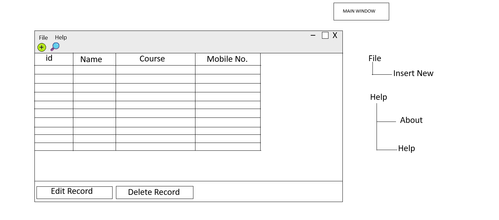
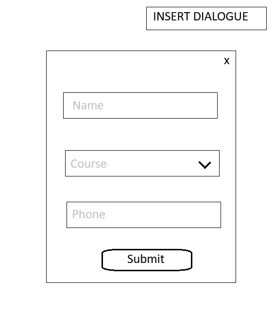
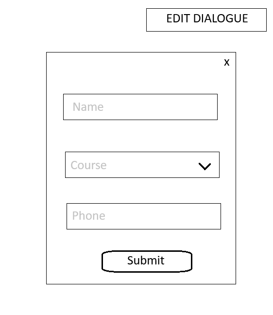
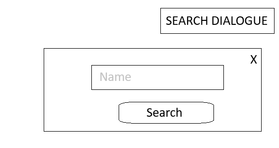
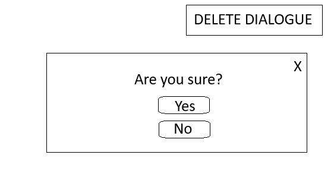

# 🎓 Student Management System

A desktop application for managing student records — built with **Python**, **PyQt6**, and **MySQL**.

---

## 📋 Overview

The Student Management System is a lightweight desktop GUI application that allows administrators to maintain a database of student records. It supports full **CRUD operations** (Create, Read, Update, Delete) through an intuitive interface backed by a local MySQL database.

---

## ✨ Features

| Feature | Description |
|---|---|
| 📄 **View Records** | Displays all students in a structured table (ID, Name, Course, Phone) |
| ➕ **Add Student** | Insert new student records via a dialog form |
| ✏️ **Edit Student** | Update existing student data with pre-filled fields |
| 🗑️ **Delete Student** | Remove records with a confirmation prompt |
| 🔍 **Search** | Search students by name and highlight matching rows |
| ℹ️ **About** | Information dialog about the application |

---

## 🖼️ UI Prototypes

### Main Window
The central view displays all student records in a table. The toolbar provides quick access to **Add** and **Search** actions. Clicking any row reveals **Edit** and **Delete** buttons in the status bar.



---

### Insert Dialogue
A clean form to add a new student — includes a name field, course dropdown (Biology, Math, Astronomy, Physics), and a phone number input.



---

### Edit Dialogue
Identical in layout to the Insert dialogue, but pre-populated with the selected student's existing data for easy modification.



---

### Search Dialogue
A minimal dialog for searching students by name. Matching rows are highlighted directly in the main table.



---

### Delete Dialogue
A confirmation prompt to prevent accidental deletions, with **Yes** / **No** options.



---

## 🛠️ Tech Stack

- **Language:** Python 3
- **GUI Framework:** PyQt6
- **Database:** MySQL (via `pymysql`)
- **Environment Management:** `python-dotenv`

---

## 📁 Project Structure

```
student-management-app/
│
├── main.py                  # Main application entry point
├── connection_testing.py    # Standalone script to verify DB connection
├── .env.example             # Template for environment variables
├── .gitignore
│
├── icons/
│   ├── add.png              # Toolbar icon for Add Student
│   └── search.png           # Toolbar icon for Search
│
└── prototypes/
    ├── main_window.png
    ├── insert_dialogue.png
    ├── edit_dialogue.png
    ├── search_dialogue.png
    └── delete_dialogue.png
```

---

## ⚙️ Setup & Installation

### Prerequisites

- Python 3.8+
- MySQL Server running locally
- A MySQL database named `school` with a `students` table

### 1. Clone the Repository

```bash
git clone https://github.com/your-username/student-management-app.git
cd student-management-app
```

### 2. Install Dependencies

```bash
pip install PyQt6 pymysql python-dotenv
```

### 3. Configure Environment Variables

Copy the example file and set your MySQL password:

```bash
cp .env.example .env
```

Edit `.env`:

```
MYSQLPASSWORD=your_mysql_password_here
```

### 4. Set Up the Database

In your MySQL client, run:

```sql
CREATE DATABASE school;
USE school;

CREATE TABLE students (
    id INT AUTO_INCREMENT PRIMARY KEY,
    name VARCHAR(255) NOT NULL,
    course VARCHAR(255) NOT NULL,
    mobile VARCHAR(20) NOT NULL
);
```

### 5. Run the Application

```bash
python main.py
```

---

## 🔌 Testing the Database Connection

To verify your database connection before launching the app:

```bash
python connection_testing.py
```

A successful connection will print:
```
Connected!
You're connected to database: (('school',),)
Connection closed.
```

---

## 📌 Notes

- The application connects to MySQL on `localhost` using the `root` user by default. Update the `DatabaseConnection` class in `main.py` if your setup differs.
- Available courses are hardcoded as: `Biology`, `Math`, `Astronomy`, `Physics`. These can be extended in both `InsertDialog` and `EditDialog`.

---

## 📄 License

This project was created as a learning exercise during *The Python Mega Course*. Feel free to modify and reuse it.
